# Rock Paper Scissors Lizard Spock

Rock, Paper, Scissors, Lizard, Spock is an adaptation of the original Rock, Paper, Scissors game. This became known from the TV show 'The Big Bang Theory'. It is a game of chance where 2 players choose a variable and reveal it at the same time. If the players tie, then they must play again until there is a winner. With the additional options of 'Lizard' and 'Spock' this allows for more possible outcomes than the original game and less chance of it ending in a tie. 

This is a responsive website created using HTML, CSS and JavaScript. The main function of the website is to provide a version of the Rock, Paper, Scissors, Lizard, Spock game that allows the user to have fun and play against the computer. In this case, the computer is a substitute for a friend or family member that they would play against in a real world scenario.

It is a simple game where the user makes a choice and this is compared to a randomly generated choice from a predetermined list of possiblities, i.e. Rock, Paper, Scissors, Lizard or Spock. Based on a defined set of rules, for which option defeats another, the winner of each round is determined. The first to win 10 rounds is the overall winner.

## User Stories

**As a user I would like to see the name of the game and a simple explanation of how the game is won.**
- In the header at the top of the page there is a title containing the name of the game reading "Rock Paper Scissors Lizard Spock".
- The header section at the top of the page also contains the line "First to 10 Wins!", which gives the user a quick indicator of what is required to win the game. The explanation of how to win a round is contained in the game rules section.

**As a user I would like to see information about how to play the game.**
- Within the game area before the game has started there is a prompt for the user to "make their choice" or to scroll down to view the full game rules.
- The game rules contains a more detailed explanation of how to win a round. It also gives the different possible winning scenarios based on the choice made by the user and the computer.

**As a user I would like to see the rules of the game.**
- The game rules are presented as a section towards the bottom of the page.
- The rules tell the user that they should choose an option from "Rock, Paper, Scissors, Lizard or Spock".
- The criteria for a "Tie" is also given, where both the user and the computer make the same choice, and it is also mentioned that no points are given in this case.
- The criteria for winning the overall game is also outlined in the game rules.
- Finally, the game rules show the possible outcomes of a round based on the choices of the user and computer.

**As a user I would like to choose an option to participate in the game.**
- The user can participate in the game by selecting one of the Rock, Paper, Scissors, Lizard or Spock buttons.
- When the user makes a selection, the computer's choice is randomly selected from the array of possible choices (Rock, Paper, Scissors, Lizard, Spock).
- The choices are compared based on the criteria outlined in the game rules in order to determine the winner of the round.

**As a user I would like to see my choice and the computer's choice for the round clearly displayed.**
- When the user makes a choice from the Rock, Paper, Scissors, Lizard and Spock options, their choice is shown in a larger circle above the options.
- The image shown in the larger circle is the same image as what the user has just clicked on, to remove any confusion as to what their choice was.
- The positioning of the user's choice and the computer's choice are intentionally below their respective scores which are located at the top of the game area.

**As a user I would like to see who has won the current game round**
- Below the user's and computer's choices a textual explanation is displayed with the criteria of how the round was won as well as who won the round. For example "Scissors Cuts Paper. You Win!".
- Including both the criteria and the result gives the user a clear indication of who won and why they won that particular round.

**As a user I would like to see the my current score and the computer's current score.**
- At the top of the game area there is an area with a dark background and high contrasting green colour where the scores for both the user, shown as "You: 2", for example, and for the computer.
- The scores are incremented after each round of the game, unless there is a "Tie" scenario as outlined in the game rules.

**As a user I would like to be able to reset the game to its initial state at any point during the game.**
- Within the game area there is a button labelled "RESET GAME".
- This button is in high contrast to the background of the game area to make it stand out visually to the user.
- Clicking this button at any point during the game will reset the game to it's initial state.

**As a user I would like to see confirmation of who has won the game.**
- Once either the user or the computer has won 10 rounds, the main game area is hidden and a winner panel is shown.
- The winner panel displays an empathetic message to the user to say whether they have won or lost the game.
- The messages are:
    - Congratulations! You are the Winner!
    - Unlucky! Computer Wins!
- The messaging is user-focused in that it congratulates the user on winning, and provides a consolitory message if the computer wins. This adds to the friendly and fun nature of the game.

## Existing Features

## Header

The header contains the name of the game: 'Rock, Paper, Scissors, Lizard, Spock'. It also contains a sub-heading “First to 10 Wins!”. This lets the player know at a glance what the purpose of the website is. It also informs the user that the winner is the first player to win 10 rounds of the game. The font used is simple, unembelished and clear. The reason for choosing Arial as the font was to make it easy to read and accessible for all users. The heading also uses contrasting colours to incerase the accessibility of the website and bright colours are used to give a cheerful, informal and visually appealing experience to the user.

<h3 align="center">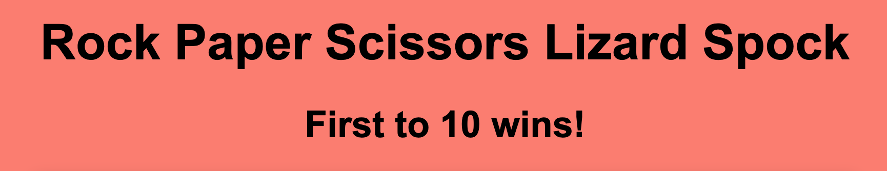</h3>

### The Scores Area

The scores are displayed directly below the header, towards the top of the page. Both the player and the computer's scores are displayed. The player is referenced as 'You' and the computer as 'Computer'. After each round, the scores are updated. The winner of each round has their score incremented by 1. In the event of a tie, neither score is changed.

<h3 align="center"></h3>

### The Winner Message

Once either the computer or the player score reaches 10, a winner message is displayed. This message gives feedback to the user about who has won the game. A "Play Again" button is also included in the winner message panel that allows the user to re-start the game and play again. 

### Winner Message - Player Wins

<h3 align="center"></h3>
 

### Winner Message - Computer Wins

<h3 align="center"></h3>

### Game Results

The game displays the choices made by the computer and the player for each round. The player's choice is displayed on the left hand side of the game area below their score and the computer's choice is displayed on the right hand side of the game area, below the computer's score. Images of either Rock, Paper, Scissors, Lizard or Spock are used to represent the player and computer's choices. The user can clearly see what choice they have made, what choice the computer has made and which player has won, as well as the current scores.

In addition to the images, text is also displayed. This shows details of who has won and also explains the reason why by including the relevant game rule. For example: If the computer chooses 'Paper' and the player chooses 'Scissors' the messages will display as "Scissors Cuts Paper. You Win!". This helps the user to familiarise themselves with the rules of the game.

<h3 align="center">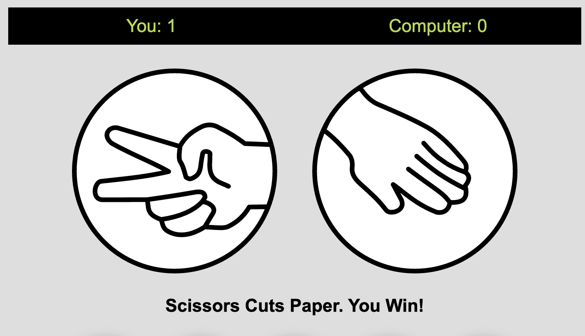</h3>

Before beginning the game this area displays placeholder images. These are also used if the "Reset" or "Play Again!" buttons are clicked. There is also placeholder text which reads "Make your choice below... or scroll down for Rules". This is intended to make the site more user-friendly and to direct the player to the relevant part of the page. 

<h3 align="center">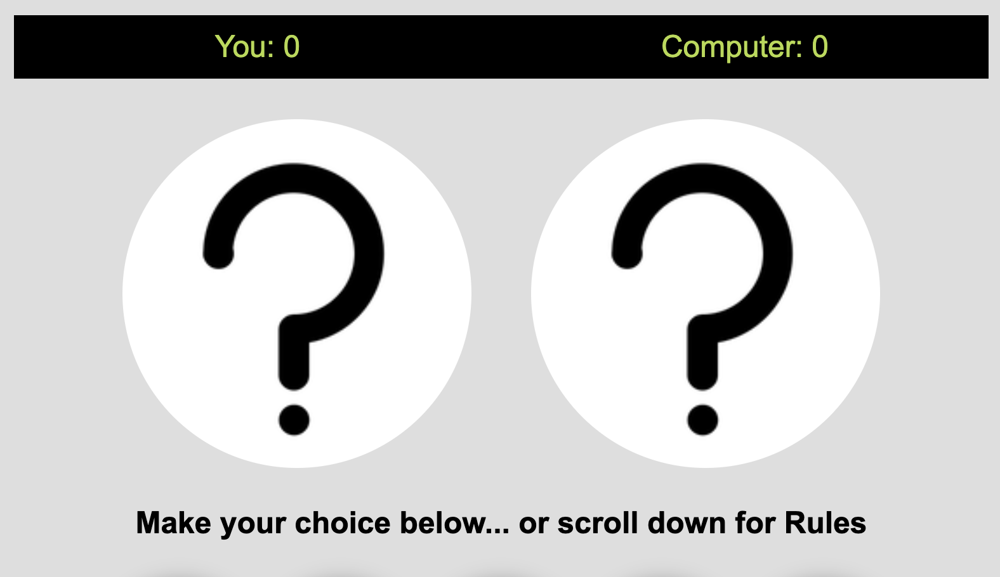</h3>

### Game Buttons

The user chooses one of the 5 game buttons to make their choice for the round. These buttons are represented by images of the possible choices; Rock, Paper, Scissors, Lizard or Spock. Once a button is pressed, the user's choice is made, the computer's choice is randomly decided, and the winner of the round is displayed.

The colour chosen for the buttons border matches the main page colour for consistency. When the user hovers over the buttons, the colour changes to highlight the choice the user is about to make. The hover color is green which contrasts with the primary design colour. This colour also matches the colour used for displaying the scores, again maintaining consistency and a robust UI design. As this game can also be played by children, I believe having the buttons displayed as pictures is more appealing in addition to making it more user friendly for all ages.

### Game Buttons - Default State

<h3 align="center">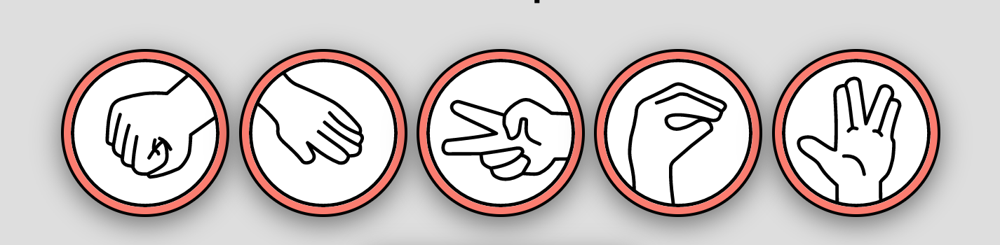</h3>

### Game Buttons - Hover State

<h3 align="center">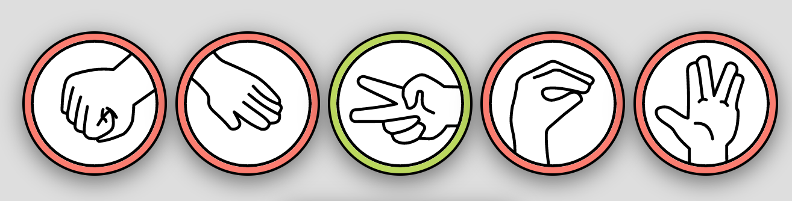</h3>

### Reset Button

At the end of the page there is a "Reset Button". If a player wants to restart the game mid-round they can click on the "Reset Game" button. Once clicked it clears the scores and sets the images and text back to the default settings. The "Reset Button" has a hover state which is the same as the background colour, keeping a consistent design across the page.

### Reset Button

<h3 align="center"></h3>

### Reset Button: Hover

<h3 align="center">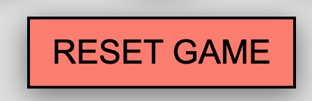</h3>

## Rules Panel

Not all users will know the rules to the game, or they may know the rules for the original game but not the Rock, Paper, Scissors, Lizard, Spock version. The rules are displayed below the main game area in a separate panel with a contrasting colour pallette for optimal readability. These allow the user to get to know the rules before the game begins, and are also available to the user at any stage during the game.

<h3 align="center">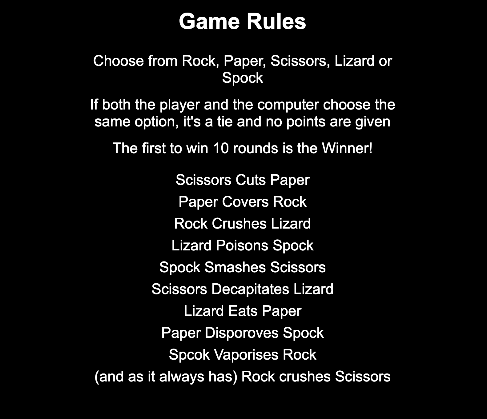</h3>

## Future Features

- In future I would like to add add an option for the user to input their name before the game begins. In this way the user's score would include the user's name instead of the current generic username of 'You'. I would also like for their name to be used as part of the winner message. This adds an element of personalisation to the game and gives a more immersive user experience.

- Another idea I would like to implement is to store the computer's choices as the game is being played. The most frequently chosen answer made by the computer would be displayed to help prompt the user to make a choice. This would give the impression that the user could influence the outcome of the game, even though the computer choices are completely random. It would add to the enjoyment of the game as the user would believe they are making a more educated guess, despite their chances of winning not changing at all.

## Testing

- I tested playing this game in different browsers: Chrome, Firefox and Safari to ensure that the game worked correctly in each.

- I tested the website on different screen-sizes and confirmed that it is responsive on the below breakpoint sizes using Chrome Dev Tools. 

    - max-width: 768px

    - max-width: 600px

- I tested common breakpoints of 375px, 600px, 768px, 1024px and above and achieved a consistent layout on all of the screen sizes using the media queries mentioned above.

### Testing: Functionality & Features

- I played the game numerous times and confirmed that the game results are always correct.

- I confirmed that the scores increment correctly.

- I confirmed that all the buttons work correctly: The Game buttons, the "Play Again" button and the "Reset" button.

- I confirmed that the "Winner Message" displays the correct message when the player wins and when the computer wins.

- I confirmed that the correct images are displayed throughout the game.

- I confirmed that the correct text is displayed against the correcponding images.

- I confirmed that the hover states work correctly on all the buttons.

### Testing: Accessibility

-  I confirmed that all parts of the game are clearly visible and easy to read. This includes the header, the scores area, the images used and the buttons as well as any text displayed on the page. 

- I confirmed that the font and colours are accessible. I also chose contrasting colours to improve readability. 

- I used Lighthouse to check the accessibility of the website and the accessibility score was 100% on both desktop and mobile devices. 

### Testing: Lighthouse - Desktop

<h3 align="center">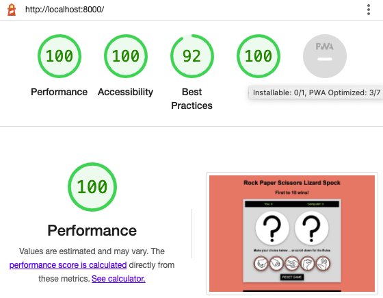</h3>

### Testing: Lighthouse - Mobile

<h3 align="center">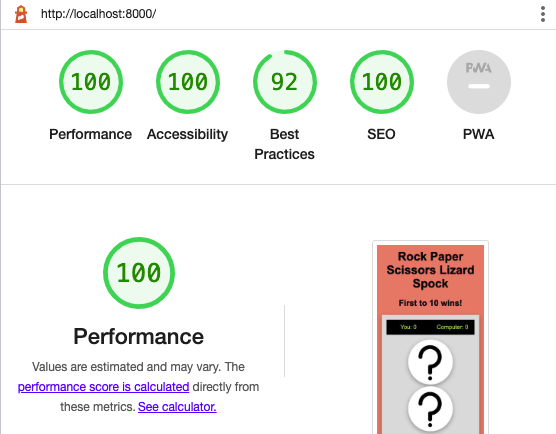</h3>

### Validator Testing

- HTML

I tested my HTML code using the HTML Validator (https://validator.w3.org/). Results/ Bugs are listed below.

- CSS

I tested my CSS code using the CSS Validator (https://jigsaw.w3.org/css-validator/). Results/ Bugs are listed below.

- JavaScript

I tested my Java Script code using the JavaScript Validator (https://jshint.com/) Results/ Bugs are listed below.

JavaScript Metrics:

- There are 8 functions in this file.

- Function with the largest signature take 2 arguments, while the median is 0.

- Largest function has 48 statements in it, while the median is 5.

- The most complex function has a cyclomatic complexity value of 44 while the median is 1.5.

## Bugs

### CSS Bugs: Border Warning
When passing my code through the CSS Validator (https://jigsaw.w3.org/css-validator/) it returned the below bugs.

- On the "Reset Button" there was a warning. This was because I had set the border color and the background color to be the same. As these were both in black there was no way to distinguish between the two.

- In order to remedy this I removed the border color from the "Reset Button" and instead added it to the "Reset Button" hover state. As this button color turns pink when in a hover state and the border is black, these contrast well with one another and the border is clearly visible.

<h3 align="center">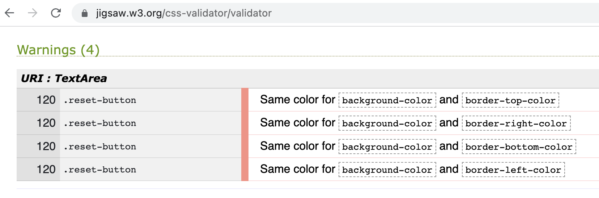</h3>

### HTML Bugs: Empty Heading Warning

When cheking my code on the HTML Validator (https://validator.w3.org/), it returned the below bug.

- On line 109 in the HTML file I had an empty h2 element. 

- In order to fix this bug I added in some placeholder text "And the winner is..." to ensure that this did not remain as an empty heading in the code. 

<h3 align="center">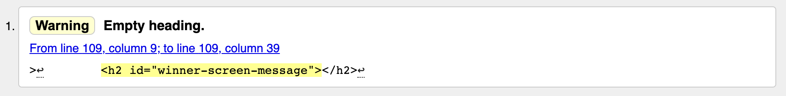</h3>

### JavaScript Bugs: Unused Variables

When checking my code in the JavaScript Validator (https://jshint.com/) it returned the below result. There were 2 unusued variables found. To resolve this, I removed both unusued variables from the code.  
 
The two variables in question were initially being used to target two separate elements that made up the "Winner Message". I later changed the code so that this was displayed within a single element with an id of "winner-message" meaning the original variables were no longer necessary.

Two unused variables:

- 5	winnerExplanation

- 6	winner

<h3 align="center">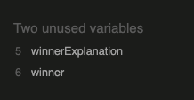</h3>

## Unfixed Bugs

- There are no unfixed bugs

## Deployment

The site was deployed to GitHub pages. The steps to deploy are as follows:

- In the GitHub repository, navigate to the Settings tab

- From the source section drop-down menu, select the Master Branch

- Once the master branch has been selected, the page will be automatically refreshed with a detailed ribbon display to indicate the successful deployment.

The live link can be found here:

## Credits

### Content

- The rules of the game were taken from a video from the Big Bang Theory television show where one of the characters "Sheldon Cooper" describes the rules of the game. A link to this video can be found here: [(https://www.youtube.com/watch?v=pIpmITBocfM)]

-All other content was written by myself.

## Media

- The images for the game buttons and game results were taken from [(https://cla-cif.github.io/RPS-Lizard-Spock/)]

- For the favicon I used an online converter [(https://www.favicon-generator.org/)] to generate a favicon of the lizard image from the above. 
